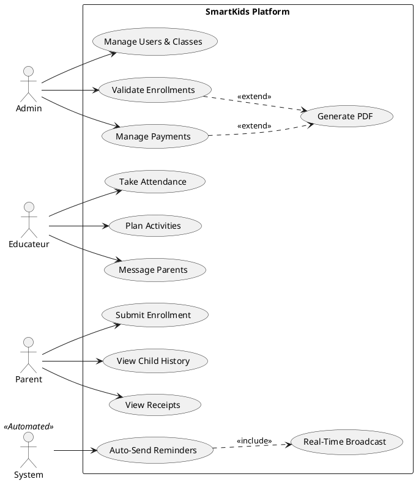
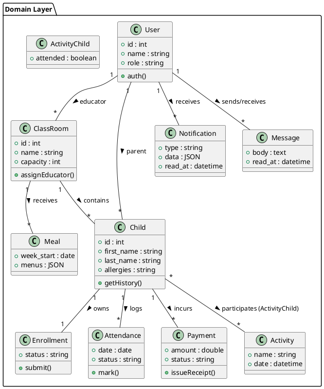
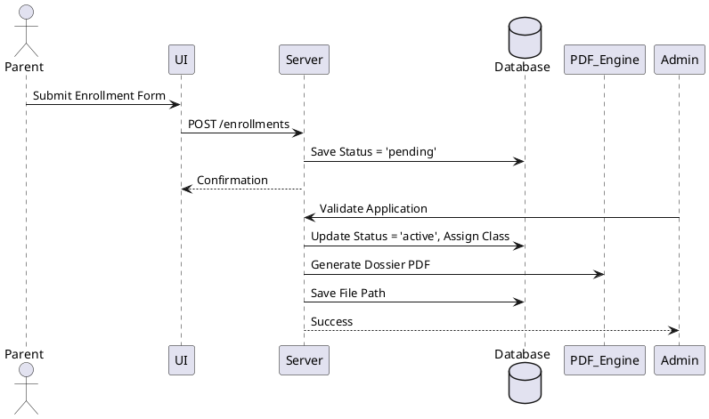
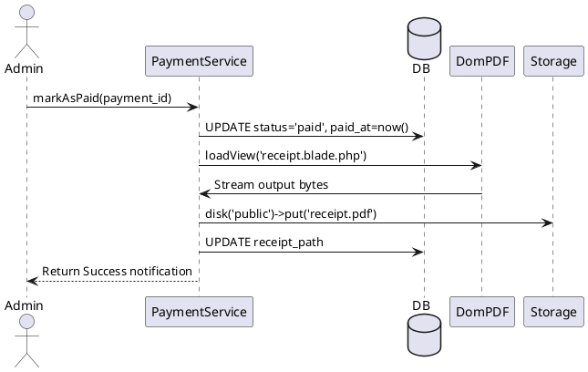
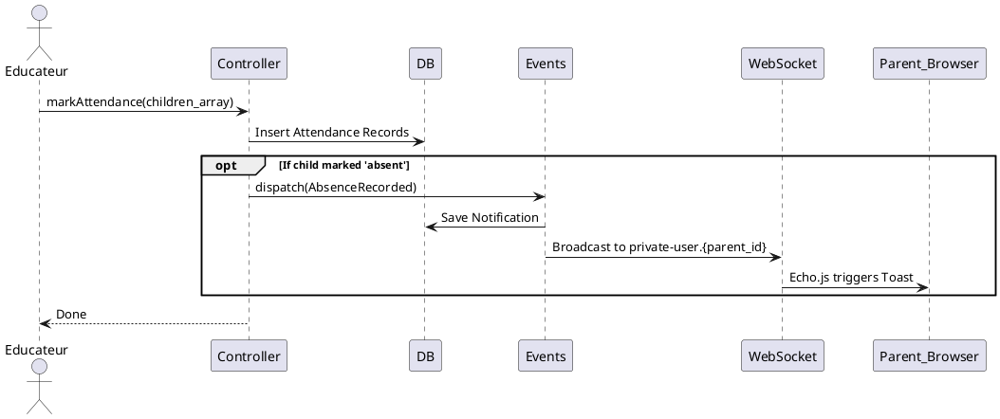
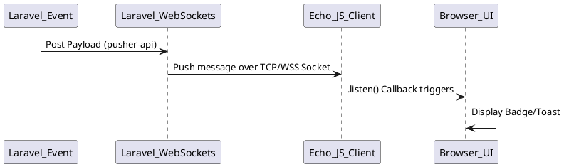
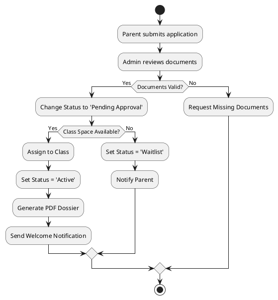
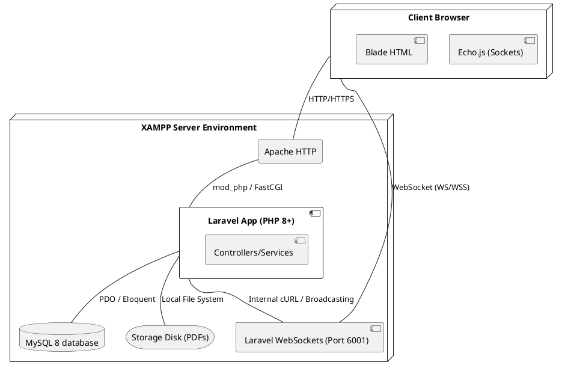

# UML Diagram Generation Guide

This document defines exactly how all UML diagrams for the SmartKids project report should be generated using PlantUML syntax.

## 1. USE CASE DIAGRAM

**Purpose:** Demonstrates all actors and their interactions with the system modules.
**Report Chapter:** Requirements Analysis / Specification.

## 2. CLASS DIAGRAM

**Purpose:** Visualizes the domain model, 11 entities, and their relationships.
**Report Chapter:** System Architecture / Database Design.

## 3. SEQUENCE DIAGRAMS

**Report Chapter:** System Design / Dynamic Modeling.

### A. Child Enrollment Flow
**Purpose:** Parent submission to admin validation.

### B. Payment Recording Flow
**Purpose:** Tracking payment and generation of DomPDF receipt.

### C. Attendance & Absence Notification Flow
**Purpose:** Taking database attendance and triggering WebSocket events.

### D. Real-Time Notification Broadcast Flow
**Purpose:** Event passing through Laravel WebSockets to Echo UI.

## 4. ACTIVITY DIAGRAM

**Purpose:** Shows the complex conditional enrollment workflow process.
**Report Chapter:** Functional Requirements / Workflows.

## 5. DEPLOYMENT DIAGRAM

**Purpose:** Illustrates the physical XAMPP-based architecture.
**Report Chapter:** System Deployment / Physical Architecture.

